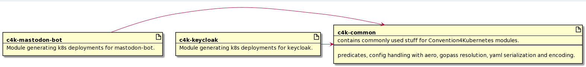

# How is the c4k-project section?

## Status

accepted

## Context

We need some place to collect common used code for our Convention4Kubernetes modules. We follow the [Bounded-Context-Separatoin rinciple](../principles/boundedContextSeparation.md).

## Decision

1. We move common used code (predicates for spec, config handling with aero, gopass resolution, yaml serialization and encoding) to c4k-common project.
2. For cli & web frontend code we accept redundancy till we've a clearer picture on how to extract commons
3. For postgres deployments we accept redundancy till we've a clearer picture on how to extract commons

## Consequences

1. We can use described code in common.
2. After more experience we will decide about a changed section.

