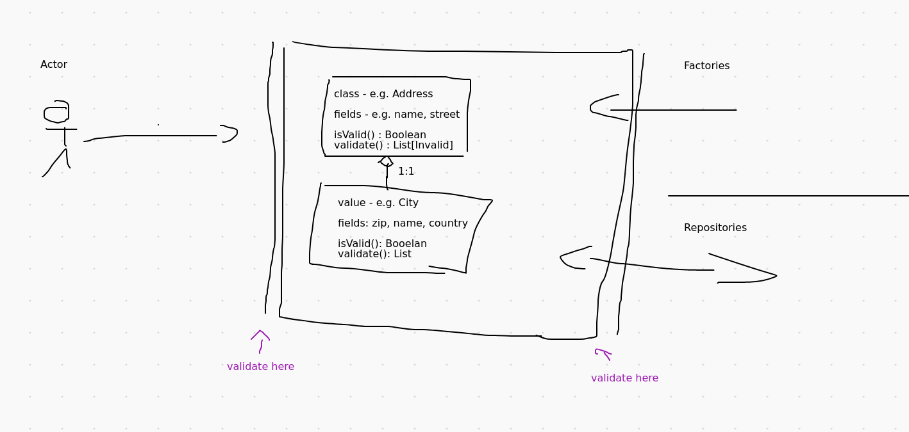

# ddd-validation

## Status

to be discussed

## Context

We want express validity on domain objects. Clear described validity helps on 
* avoid many redundant and unnecessary (null-)checks spread around in the code
* collects all validity constraints to one defined place

### Principles affected

* Check the domain borders
* Do not tie validation to object creation / serialization
* propagate validation through aggregates

### see also:
* [Fowler] Do not use exceptions for validation: https://martinfowler.com/articles/replaceThrowWithNotification.html
* [Fowler] Contextual Validation: https://martinfowler.com/bliki/ContextualValidation.html
* [Vladimir Khorikov] Some ideas for validation in DDD: https://enterprisecraftsmanship.com/posts/validation-and-ddd/
